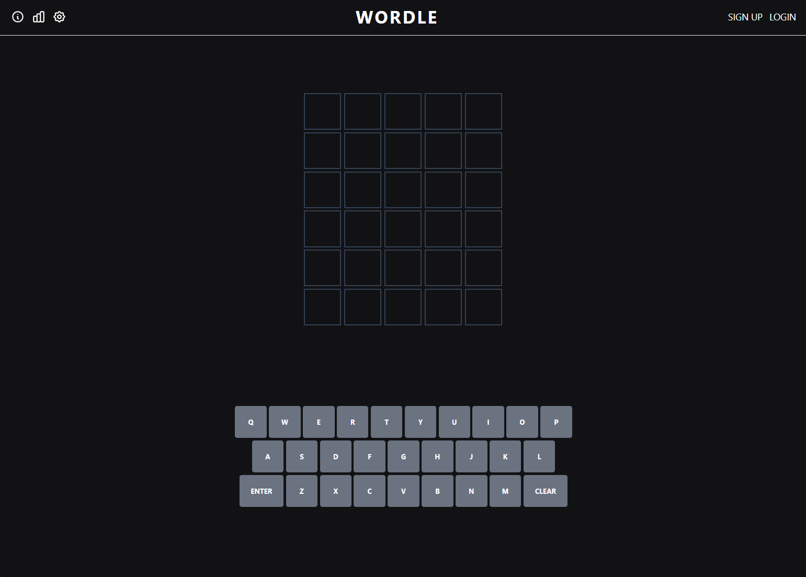

# fullstack-project-wordle

a Wordle-clone made for the Full Stack -web development project of University of Helsinki

[**Activity log can be found here**](hours.md)

[**Deployed application can be found here**](https://fullstack-wordle.onrender.com)
 Note: Render puts free services on standby after 15 minutes of inactivity ([source](https://render.com/docs/free#free-web-services)), so the first load of the page might take a while

[**Write-up about the project can be found here**](project.md)
